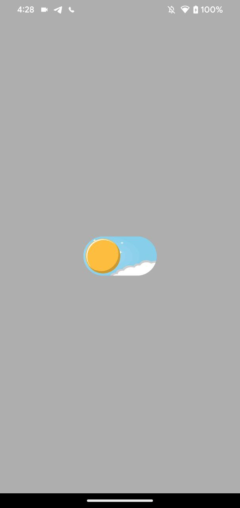
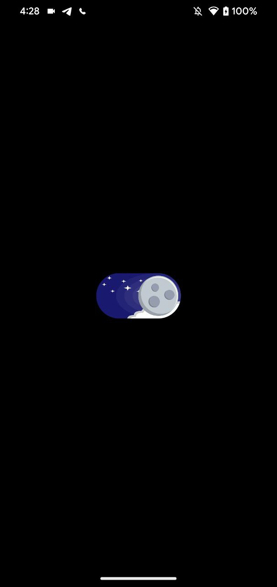
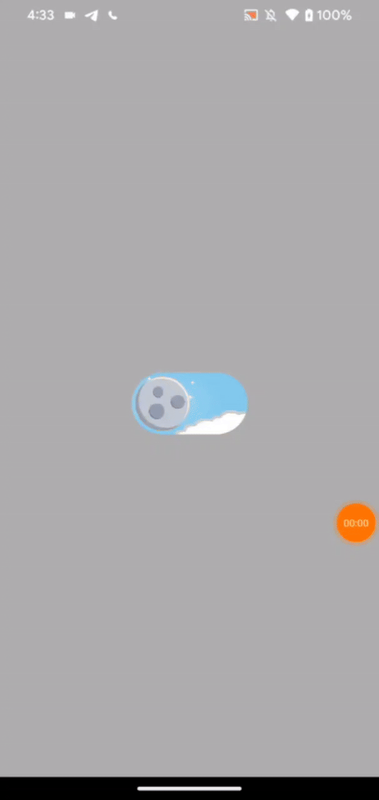

# Dark 😴 Mode 👀 App 📱

This is a Demo Android application that implements a custom dark mode switch to toggle between light and dark themes with animation.

## App 📲 Screenshots 📸

  
   

## App 📲 Demo 📸

## License 📄

Feel free to use this code. I also took inspiration and some logic code from someone else.
